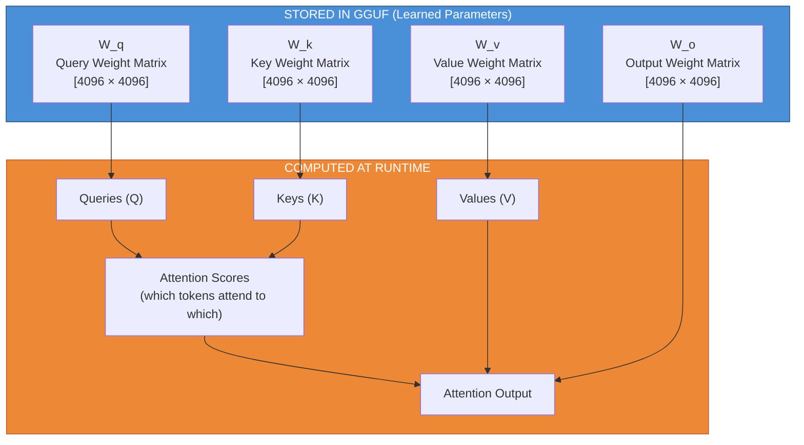
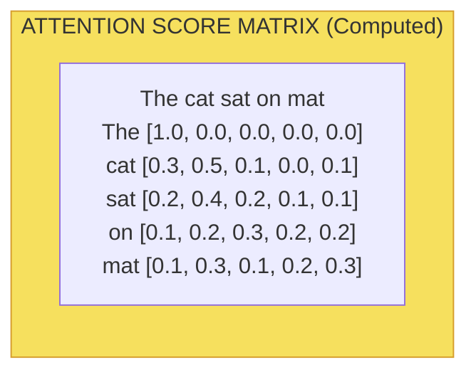
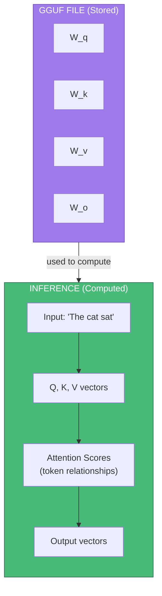
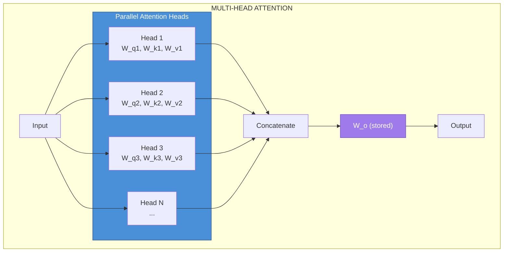
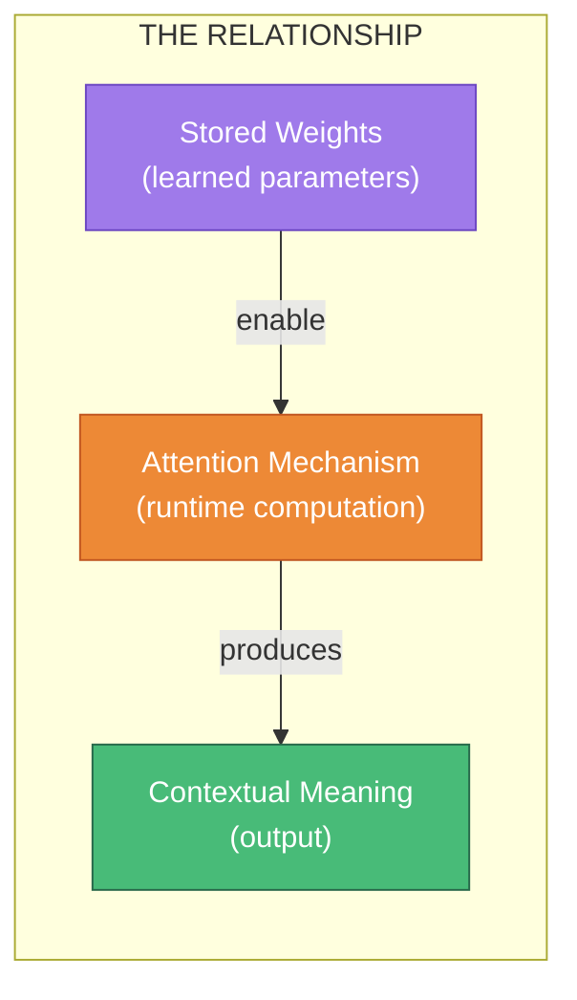

# The Relationship Between Attention and Weights

## The Short Answer

**Weights** are the stored, learned parameters. **Attention** is a computation that *uses* those weights to determine how tokens relate to each other at runtime.

```
Weights = Stored (learned during training)
Attention Scores = Computed (calculated fresh for every input)
```

---

## The Two Types of "Weights" People Confuse

| Term | What It Is | Stored in GGUF? |
|------|-----------|-----------------|
| **Model Weights** | Learned parameters (W_q, W_k, W_v matrices) | ✅ Yes |
| **Attention Weights/Scores** | Token-to-token relevance scores | ❌ No (computed at runtime) |

This naming collision causes confusion. When someone says "attention weights," they usually mean the **attention scores** — which are *not* stored.

---

## How Attention Works



---

## Step-by-Step Breakdown

### Step 1: Project Input Using Stored Weights

For each token's embedding vector `x`:

```
Q = x × W_q    (Query: "What am I looking for?")
K = x × W_k    (Key: "What do I contain?")
V = x × W_v    (Value: "What information do I provide?")
```

The weight matrices `W_q`, `W_k`, `W_v` are **stored in the GGUF file**. They were learned during training.

### Step 2: Compute Attention Scores (Runtime)

```
Attention_Scores = softmax( (Q × K^T) / √d )
```

This produces a matrix showing how much each token should "pay attention" to every other token.



**This matrix is NOT stored** — it's computed fresh for every input sequence.

### Step 3: Apply Scores to Values

```
Output = Attention_Scores × V
```

Each token's output is a weighted combination of all Value vectors, where the weights come from the attention scores.

### Step 4: Project Through Output Weight

```
Final_Output = Output × W_o
```

The output weight matrix `W_o` is **stored in the GGUF file**.

---

## Visual: Stored vs Computed



---

## Why This Design?

### The Power of Learned Projections

The weight matrices learn **how to create good queries, keys, and values** during training:

| Matrix | What It Learns |
|--------|----------------|
| `W_q` | How to formulate "questions" about what information is needed |
| `W_k` | How to create "labels" describing what each token contains |
| `W_v` | How to package the actual information to be retrieved |
| `W_o` | How to combine multi-head outputs into a useful representation |

### Dynamic Relationships

Because attention scores are computed at runtime:

- The same model can handle **any input text**
- Token relationships are **context-dependent**
- "Bank" attends to "river" differently than to "money"

---

## Multi-Head Attention

Real models use multiple attention "heads" in parallel:



Each head has its **own stored weight matrices** but computes its **own attention scores** at runtime. Different heads can learn to focus on different types of relationships:

- Head 1: Syntactic relationships (subject-verb)
- Head 2: Positional relationships (nearby words)
- Head 3: Semantic relationships (synonyms, concepts)

---

## Concrete Example

Given the input: **"The cat sat on the mat"**

### Stored (in GGUF):

```
blk.0.attn_q.weight  = [4096 × 4096 matrix of floats]
blk.0.attn_k.weight  = [4096 × 4096 matrix of floats]
blk.0.attn_v.weight  = [4096 × 4096 matrix of floats]
blk.0.attn_output.weight = [4096 × 4096 matrix of floats]
```

### Computed (at runtime):

```
Q for "cat" = embedding("cat") × W_q = [0.12, -0.45, 0.89, ...]
K for "sat" = embedding("sat") × W_k = [0.34, 0.21, -0.56, ...]

Attention score ("cat" → "sat") = softmax(Q_cat · K_sat / √d) = 0.42
```

This score 0.42 means "cat" pays 42% of its attention to "sat" in this context.

---

## The Attention Formula

```
Attention(Q, K, V) = softmax(Q × K^T / √d_k) × V
```

| Component | Source | Stored? |
|-----------|--------|---------|
| Q | Input × W_q | W_q stored, Q computed |
| K | Input × W_k | W_k stored, K computed |
| V | Input × W_v | W_v stored, V computed |
| √d_k | Constant (embedding dimension) | N/A |
| softmax(...) | Attention scores | Computed |
| Final result | Weighted sum of values | Computed |

---

## Summary Table

| Concept | Stored in GGUF? | Purpose |
|---------|-----------------|---------|
| W_q, W_k, W_v, W_o | ✅ Yes | Transform inputs into Q, K, V |
| Attention scores | ❌ No | Determine token-to-token relevance |
| Q, K, V vectors | ❌ No | Intermediate representations |
| Final attention output | ❌ No | Contextualized token representations |

---

## Key Insight



**Weights are the "recipe"** — they define the transformations.  
**Attention is the "cooking"** — it applies those transformations to produce context-aware understanding.

The weights learn *how* to compute good attention. The attention scores themselves emerge from the input.

---

*Guide explaining the relationship between attention and weights in transformer models*
