# GGUF File Format: Complete Structural Guide

## Overview

**GGUF** (GPT-Generated Unified Format) is a binary file format designed for storing large language models. It is the successor to the older GGML format and is primarily used by **llama.cpp** and compatible inference engines. GGUF is optimized for fast loading, memory-mapped access, and single-file distribution of quantized models.

---

## High-Level File Structure

A GGUF file is organized into four major logical regions, read sequentially:

```mermaid
flowchart TB
    subgraph GGUF["GGUF FILE STRUCTURE"]
        direction TB
        A["📋 HEADER<br/>Magic + Version + Counts"]
        B["🏷️ METADATA KV PAIRS<br/>Model Configuration"]
        C["📐 TENSOR INFOS<br/>Tensor Descriptors"]
        D["💾 TENSOR DATA<br/>Quantized Weights"]
    end
    
    A --> B --> C --> D
    
    style A fill:#4a90d9,stroke:#2c5282,color:#fff
    style B fill:#48bb78,stroke:#276749,color:#fff
    style C fill:#ed8936,stroke:#c05621,color:#fff
    style D fill:#9f7aea,stroke:#6b46c1,color:#fff
```



---

## Section 1: Header

The header is the first **24 bytes** of every GGUF file and contains essential identification and counting information.

### Header Layout


### Header Fields Explained

| Offset | Size | Field | Type | Description |
|--------|------|-------|------|-------------|
| 0x00 | 4 | Magic | char[4] | ASCII string `GGUF` (0x47475546) - identifies file format |
| 0x04 | 4 | Version | uint32_t | Format version (currently 3) |
| 0x08 | 8 | Tensor Count | uint64_t | Number of tensors stored in the file |
| 0x10 | 8 | Metadata KV Count | uint64_t | Number of metadata key-value pairs |

### Version History


---

## Section 2: Metadata Key-Value Pairs

Immediately following the header, metadata is stored as a sequence of key-value pairs. This section contains all model configuration, architecture details, tokenizer data, and custom attributes.

### Metadata Structure Overview


### Value Types

GGUF supports multiple data types for metadata values:


### Type ID Reference Table

| Type ID | Name | Size | Description |
|---------|------|------|-------------|
| 0 | UINT8 | 1 byte | Unsigned 8-bit integer |
| 1 | INT8 | 1 byte | Signed 8-bit integer |
| 2 | UINT16 | 2 bytes | Unsigned 16-bit integer |
| 3 | INT16 | 2 bytes | Signed 16-bit integer |
| 4 | UINT32 | 4 bytes | Unsigned 32-bit integer |
| 5 | INT32 | 4 bytes | Signed 32-bit integer |
| 6 | FLOAT32 | 4 bytes | 32-bit floating point |
| 7 | BOOL | 1 byte | Boolean (0 or 1) |
| 8 | STRING | variable | Length-prefixed UTF-8 string |
| 9 | ARRAY | variable | Homogeneous typed array |
| 10 | UINT64 | 8 bytes | Unsigned 64-bit integer |
| 11 | INT64 | 8 bytes | Signed 64-bit integer |
| 12 | FLOAT64 | 8 bytes | 64-bit floating point |

### Common Metadata Keys


### String Encoding Detail


### Array Encoding Detail

```mermaid
flowchart LR
    subgraph ARRAY["ARRAY VALUE ENCODING"]
        direction LR
        AT["Element Type<br/>uint32<br/>4 bytes"]
        AC["Array Count<br/>uint64<br/>8 bytes"]
        AE["Elements<br/>type × count<br/>variable"]
    end
    
    AT --> AC --> AE
    
    style AT fill:#ed8936,stroke:#c05621,color:#fff
    style AC fill:#4299e1,stroke:#2b6cb0,color:#fff
    style AE fill:#9f7aea,stroke:#6b46c1,color:#fff
```



---

## Section 3: Tensor Information

After metadata, the file contains descriptors for each tensor. These descriptors define tensor names, shapes, data types, and offsets into the data section.

### Tensor Info Structure

```mermaid
flowchart TB
    subgraph TENSORS["TENSOR INFO SECTION"]
        direction TB
        T1["Tensor Info 1"]
        T2["Tensor Info 2"]
        T3["Tensor Info 3"]
        TN["Tensor Info N..."]
    end
    
    subgraph TINFO["SINGLE TENSOR INFO"]
        direction LR
        NL["Name Length<br/>uint64"]
        NS["Name String<br/>UTF-8"]
        ND["N Dimensions<br/>uint32"]
        DM["Dimensions<br/>uint64 × N"]
        TT["Tensor Type<br/>uint32"]
        OF["Data Offset<br/>uint64"]
    end
    
    T1 --> T2 --> T3 --> TN
    
    style NL fill:#4299e1,stroke:#2b6cb0,color:#fff
    style NS fill:#48bb78,stroke:#2f855a,color:#fff
    style ND fill:#ed8936,stroke:#c05621,color:#fff
    style DM fill:#f6e05e,stroke:#d69e2e,color:#333
    style TT fill:#fc8181,stroke:#c53030,color:#fff
    style OF fill:#9f7aea,stroke:#6b46c1,color:#fff
```



### Tensor Info Fields

| Field | Type | Description |
|-------|------|-------------|
| Name Length | uint64_t | Length of tensor name in bytes |
| Name | char[] | UTF-8 encoded tensor name |
| N Dimensions | uint32_t | Number of dimensions (1-4 typically) |
| Dimensions | uint64_t[] | Size of each dimension |
| Type | uint32_t | Quantization/data type ID |
| Offset | uint64_t | Byte offset from start of tensor data section |

### Tensor/Quantization Types


### Quantization Type IDs

| ID | Type | Bits/Weight | Block Size | Description |
|----|------|-------------|------------|-------------|
| 0 | F32 | 32 | 1 | Full 32-bit float |
| 1 | F16 | 16 | 1 | Half precision float |
| 2 | Q4_0 | 4 | 32 | 4-bit quantization |
| 3 | Q4_1 | 4.5 | 32 | 4-bit with min value |
| 6 | Q5_0 | 5 | 32 | 5-bit quantization |
| 7 | Q5_1 | 5.5 | 32 | 5-bit with min value |
| 8 | Q8_0 | 8 | 32 | 8-bit quantization |
| 10 | Q2_K | 2.5 | 256 | K-quant 2-bit |
| 11 | Q3_K | 3.4 | 256 | K-quant 3-bit |
| 12 | Q4_K | 4.5 | 256 | K-quant 4-bit |
| 13 | Q5_K | 5.5 | 256 | K-quant 5-bit |
| 14 | Q6_K | 6.5 | 256 | K-quant 6-bit |
| 30 | BF16 | 16 | 1 | Brain float 16 |

---

## Section 4: Tensor Data

The final and largest section contains the actual tensor weights. Data is aligned for efficient memory-mapped access.

### Alignment and Padding


### Data Section Properties

- **Alignment**: Data starts at a 32-byte aligned offset (configurable, default 32)
- **Tensor Order**: Tensors are stored in the order their info appears
- **No Padding Between Tensors**: Tensors are packed contiguously (type-specific alignment may apply)
- **Offsets**: Each tensor's offset is relative to the start of the data section

---

## Complete File Layout


---

## Memory Mapping

GGUF is designed for efficient memory-mapped loading:


### Benefits of Memory Mapping

1. **Fast Load Times**: Only metadata is read initially
2. **On-Demand Loading**: Tensor pages loaded only when accessed
3. **Shared Memory**: Multiple processes can share the same mapped file
4. **Low Memory Overhead**: No need to copy data from disk buffer

---

## Typical Model Architecture in GGUF


---

## Reading GGUF in Python

Here's a minimal example for reading GGUF headers on Windows (CPU only):

```python
import struct

def read_gguf_header(filepath):
    """Read GGUF file header information."""
    with open(filepath, 'rb') as f:
        # Read magic
        magic = f.read(4)
        if magic != b'GGUF':
            raise ValueError(f"Invalid GGUF magic: {magic}")
        
        # Read version (uint32, little-endian)
        version = struct.unpack('<I', f.read(4))[0]
        
        # Read tensor count (uint64, little-endian)
        tensor_count = struct.unpack('<Q', f.read(8))[0]
        
        # Read metadata kv count (uint64, little-endian)
        metadata_kv_count = struct.unpack('<Q', f.read(8))[0]
        
        return {
            'magic': magic.decode('ascii'),
            'version': version,
            'tensor_count': tensor_count,
            'metadata_kv_count': metadata_kv_count
        }

# Usage
# header = read_gguf_header("model.gguf")
# print(header)
```

---

## Tools for Working with GGUF

| Tool | Purpose | Platform |
|------|---------|----------|
| `llama.cpp` | Inference engine | Windows/Linux/Mac |
| `gguf-py` | Python GGUF library | Cross-platform |
| `llama-quantize` | Quantization tool | Windows/Linux/Mac |
| `llama-gguf` | GGUF manipulation | Windows/Linux/Mac |

---

## Summary

```mermaid
flowchart TB
    subgraph SUMMARY["GGUF FORMAT SUMMARY"]
        direction LR
        
        S1["🔒 Self-Contained<br/>Single file distribution"]
        S2["⚡ Memory Mapped<br/>Fast loading"]
        S3["📊 Quantized<br/>Reduced size"]
        S4["📋 Metadata Rich<br/>Complete model info"]
    end
    
    style S1 fill:#4299e1,stroke:#2b6cb0,color:#fff
    style S2 fill:#48bb78,stroke:#2f855a,color:#fff
    style S3 fill:#ed8936,stroke:#c05621,color:#fff
    style S4 fill:#9f7aea,stroke:#6b46c1,color:#fff
```



**Key Takeaways:**

1. **Header (24 bytes)**: Magic number, version, counts
2. **Metadata**: Key-value pairs for model configuration and tokenizer
3. **Tensor Info**: Names, dimensions, types, and offsets for each tensor
4. **Tensor Data**: Aligned, quantized weight data

GGUF enables efficient distribution and inference of large language models on consumer hardware, including CPU-only systems like your Lenovo Yoga with 32GB RAM.

---

*Guide generated for GGUF format version 3*
