# Safetensors File Format Structure

The `.safetensors` format is a simple, fast, and safe file format created by Hugging Face for storing tensors. It was designed to address security vulnerabilities in pickle-based formats (like PyTorch's `.pt` files) while being extremely fast to load.

---

## High-Level Structure

A safetensors file consists of exactly **three sequential regions**:


---

## 1. Header Size (Bytes 0–7)

The first 8 bytes store a **little-endian unsigned 64-bit integer** indicating the size of the JSON header in bytes.


**Key Points:**
- Little-endian byte order (least significant byte first)
- Maximum theoretical header size: 2^64 bytes (practically limited by file system)
- This fixed-size prefix enables fast header parsing

---

## 2. JSON Header (Bytes 8 to 8+N)

The header is a **UTF-8 encoded JSON object** containing metadata for all tensors and optional file-level metadata.


### Tensor Entry Fields

| Field | Type | Description |
|-------|------|-------------|
| `dtype` | string | Data type of tensor elements |
| `shape` | array of integers | Dimensions of the tensor |
| `data_offsets` | [start, end] | Byte range in data region (exclusive end) |

### Header JSON Example

```json
{
  "__metadata__": {
    "format": "pt",
    "author": "huggingface",
    "description": "Example model weights"
  },
  "model.embed.weight": {
    "dtype": "F16",
    "shape": [50257, 768],
    "data_offsets": [0, 77194752]
  },
  "model.layer.0.attn.weight": {
    "dtype": "F16",
    "shape": [768, 768],
    "data_offsets": [77194752, 78373888]
  },
  "model.layer.0.attn.bias": {
    "dtype": "F16",
    "shape": [768],
    "data_offsets": [78373888, 78375424]
  }
}
```

### The `__metadata__` Section

- **Optional** section for arbitrary file-level metadata
- All values must be **strings** (not numbers or objects)
- Common uses: format version, author, training info, license

---

## 3. Tensor Data Region (Bytes 8+N onwards)

Raw tensor bytes stored contiguously. Each tensor's location is defined by `data_offsets` **relative to the start of the data region** (not the file).


### Calculating Tensor Size

The size of each tensor in bytes can be calculated as:

```
tensor_size = data_offsets[1] - data_offsets[0]
```

Or verified via shape and dtype:

```
tensor_size = product(shape) × bytes_per_element(dtype)
```

---

## Complete File Layout with Byte Addresses


### Address Calculation Formula

To find the absolute file position of a tensor:

```
absolute_position = 8 + header_size + data_offsets[0]
```

---

## Supported Data Types

| dtype String | Description | Bytes per Element | NumPy Equivalent |
|--------------|-------------|-------------------|------------------|
| `F64` | 64-bit float | 8 | `float64` |
| `F32` | 32-bit float | 4 | `float32` |
| `F16` | 16-bit float | 2 | `float16` |
| `BF16` | Brain float 16 | 2 | N/A (use `bfloat16`) |
| `I64` | 64-bit signed int | 8 | `int64` |
| `I32` | 32-bit signed int | 4 | `int32` |
| `I16` | 16-bit signed int | 2 | `int16` |
| `I8` | 8-bit signed int | 1 | `int8` |
| `U8` | 8-bit unsigned int | 1 | `uint8` |
| `BOOL` | Boolean | 1 | `bool` |

---

## Memory Mapping Advantage

```mermaid
flowchart LR
    subgraph "Traditional Loading"
        A1[Read File] --> A2[Parse All] --> A3[Allocate RAM] --> A4[Copy to RAM]
    end
    
    subgraph "Safetensors Memory Mapping"
        B1[Open File] --> B2[Parse Header Only] --> B3[mmap Data Region] --> B4[Access on Demand]
    end
    
    A4 --> SLOW["❌ Slow, High RAM"]
    B4 --> FAST["✅ Fast, Low RAM"]
    
    style SLOW fill:#e74c3c,color:#fff
    style FAST fill:#27ae60,color:#fff
```



### Why Memory Mapping Works

The key design benefit: since offsets point directly into contiguous raw data, the entire data region can be **memory-mapped**. 

Benefits include:
- **Fast startup**: Only header is parsed initially
- **Lazy loading**: Tensor bytes loaded only when accessed
- **Shared memory**: Multiple processes can share the same mapped region
- **Reduced RAM**: OS manages page swapping automatically

---

## Why It's "Safe"

```mermaid
graph TB
    subgraph "Security Comparison"
        direction LR
        
        subgraph "Pickle (.pt, .pkl)"
            P1["Arbitrary Python Code"] --> P2["Can Execute on Load"] --> P3["🔴 Remote Code Execution Risk"]
        end
        
        subgraph "Safetensors"
            S1["JSON + Raw Bytes Only"] --> S2["No Code Execution"] --> S3["🟢 Safe to Load"]
        end
    end
    
    style P3 fill:#e74c3c,color:#fff
    style S3 fill:#27ae60,color:#fff
```



### Security Features

1. **No code execution**: Contains only JSON and raw numeric data
2. **Bounded reads**: Header size prevents buffer overflow attacks
3. **Validation**: Offsets can be verified before accessing data
4. **Deterministic parsing**: No deserialization of arbitrary objects

---

## Summary Table

| Region | Start Address | Size | Content |
|--------|---------------|------|---------|
| Header Size | `0x0000` | 8 bytes | Little-endian uint64 |
| JSON Header | `0x0008` | N bytes (from header size) | UTF-8 JSON with tensor metadata |
| Tensor Data | `0x0008 + N` | Remaining file | Raw contiguous tensor bytes |

---

## Reading a Safetensors File (Pseudocode)

```python
def read_safetensors(filepath):
    with open(filepath, 'rb') as f:
        # 1. Read header size (first 8 bytes)
        header_size = int.from_bytes(f.read(8), byteorder='little')
        
        # 2. Read and parse JSON header
        header_json = f.read(header_size).decode('utf-8')
        header = json.loads(header_json)
        
        # 3. Data region starts at offset 8 + header_size
        data_start = 8 + header_size
        
        # 4. Load specific tensor
        tensor_info = header['model.embed.weight']
        start, end = tensor_info['data_offsets']
        
        f.seek(data_start + start)
        raw_bytes = f.read(end - start)
        
        # 5. Convert to numpy array
        dtype_map = {'F32': np.float32, 'F16': np.float16, ...}
        array = np.frombuffer(raw_bytes, dtype=dtype_map[tensor_info['dtype']])
        array = array.reshape(tensor_info['shape'])
        
        return array
```

---

## References

- [Hugging Face Safetensors Repository](https://github.com/huggingface/safetensors)
- [Safetensors Documentation](https://huggingface.co/docs/safetensors)
