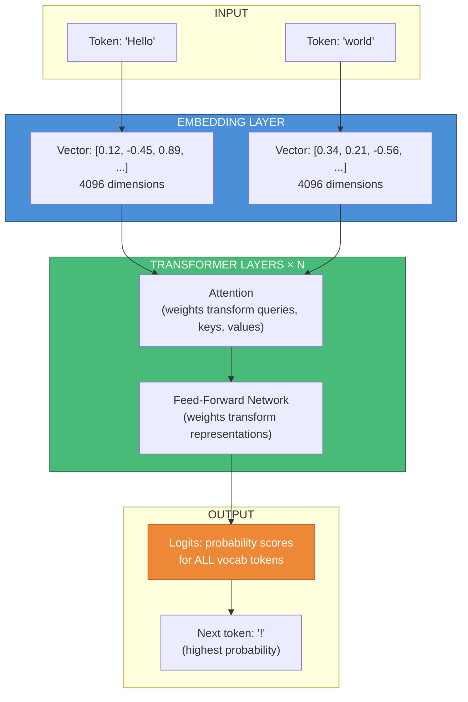
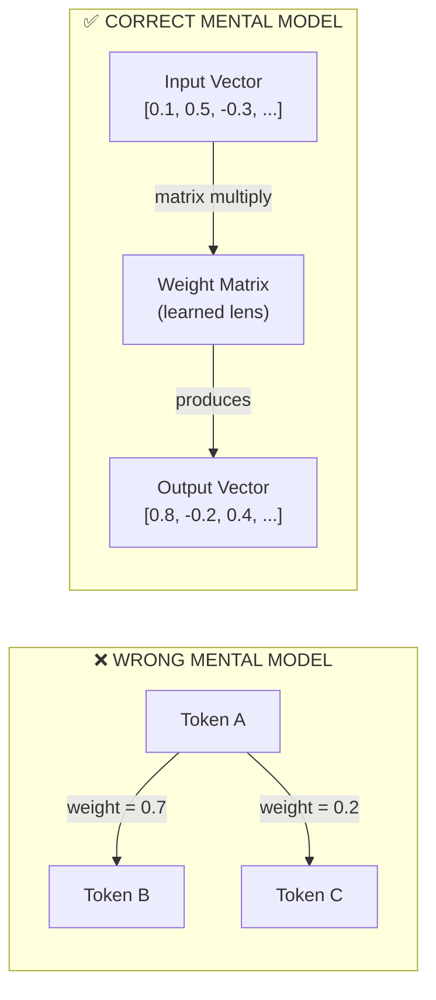
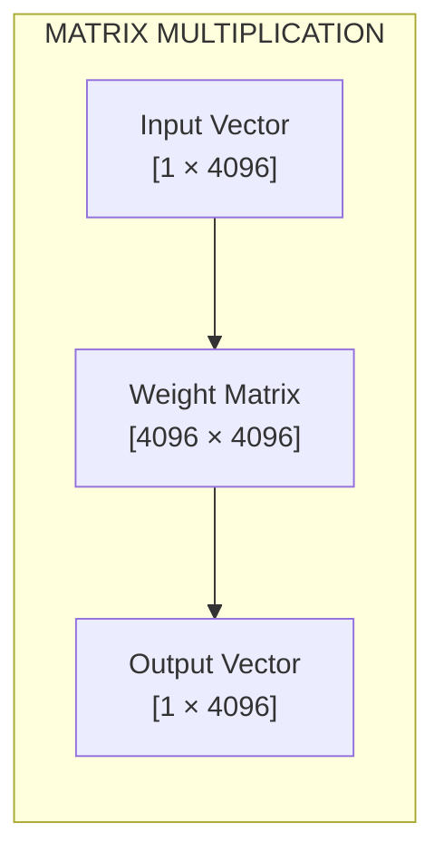
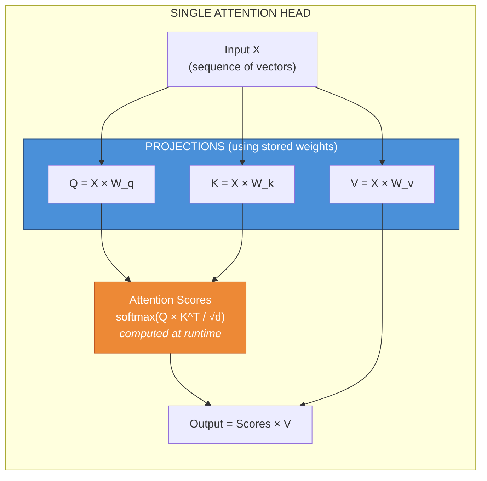
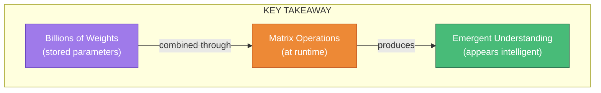

# Transformer Weights Explained: What They Actually Are

## Common Misconception

A common misconception is that weights represent the "value of a path from one token to another." This is incorrect.

**Weights are learned numerical parameters** stored in matrices (tensors). They don't represent direct "paths between tokens" — instead, they define **transformations** that the model applies to convert inputs into outputs through many layers.

```
Weights ≠ "Token A → Token B = 0.7"

Weights = Matrices that transform vectors through mathematical operations
```

---

## How Tokens Actually Flow Through the Model



---

## The Key Weight Tensors in a Transformer

Each tensor serves a specific mathematical purpose:

### 1. Token Embeddings (`token_embd.weight`)

```
Shape: [vocab_size × embedding_dim]
Example: [32000 × 4096]
```

- Maps each token ID to a dense vector
- Token 1547 ("Hello") → look up row 1547 → get 4096-dimensional vector
- **This is a lookup table, not a path**

### 2. Attention Weights (per layer)

```
Q weight: [hidden_dim × hidden_dim]  — transforms input to "Query"
K weight: [hidden_dim × hidden_dim]  — transforms input to "Key"  
V weight: [hidden_dim × hidden_dim]  — transforms input to "Value"
O weight: [hidden_dim × hidden_dim]  — projects attention output
```

- These matrices learn **what to pay attention to**
- Attention scores between tokens are *computed at runtime*, not stored

### 3. Feed-Forward Weights (per layer)

```
ffn_up:   [hidden_dim × intermediate_dim]
ffn_down: [intermediate_dim × hidden_dim]
ffn_gate: [hidden_dim × intermediate_dim]  (for gated architectures)
```

- Transform the representation through a non-linear "thinking" step

### 4. Output Layer (`output.weight`)

```
Shape: [embedding_dim × vocab_size]
Example: [4096 × 32000]
```

- Converts final hidden state → scores for every possible next token

---

## Analogy: Weights as "Lenses"



Weights are like **lenses** that transform the meaning of input vectors. The model learns during training how to shape these lenses so that, after many transformations, the final output correctly predicts the next token.

---

## What the "Token→Token" Model Might Be Confused With

| Concept | What It Is |
|---------|-----------|
| **N-gram models** | Older models that *did* store direct token→token probabilities |
| **Attention scores** | Computed *at runtime* (not stored) — how much each token attends to others |
| **Graph neural networks** | Where edge weights connect nodes directly |

In transformers, the "relationship" between tokens is **computed dynamically** through matrix operations using the stored weights — it's not pre-stored as a lookup table.

---

## Matrix Multiplication: The Core Operation

Every layer applies weights through matrix multiplication:



**Mathematical form:**

```
output = input × weight_matrix + bias
```

Each element in the output is a weighted sum of all input elements. The weights determine *how* to combine the input values.

---

## Example: A Single Attention Head



**Key insight:** The weights (`W_q`, `W_k`, `W_v`) are stored, but the attention scores (which tokens attend to which) are **computed fresh** for every input.

---

## Stored vs. Computed

| Stored in GGUF Weights | Computed at Runtime |
|------------------------|---------------------|
| Weight matrices (parameters) | Token-to-token attention scores |
| Token embeddings (lookup table) | Attention patterns |
| Layer normalization values | Intermediate activations |
| Bias terms | Probability distributions |

---

## Why Quantization Works

Since weights are just numbers in matrices, we can **compress** them:

| Precision | Bits per Weight | Memory for 7B Model |
|-----------|-----------------|---------------------|
| FP32 | 32 bits | ~28 GB |
| FP16 | 16 bits | ~14 GB |
| Q8_0 | 8 bits | ~7 GB |
| Q4_K | ~4.5 bits | ~4 GB |
| Q2_K | ~2.5 bits | ~2.5 GB |

Quantization trades precision for size. The model still performs the same operations, just with less precise numbers.

---

## Summary

The magic of LLMs is that billions of weight values, when combined through matrix multiplications across many layers, produce emergent behavior that *appears* to understand token relationships — but those relationships are **computed, not stored**.



---


*Guide created to clarify transformer weight mechanics*
