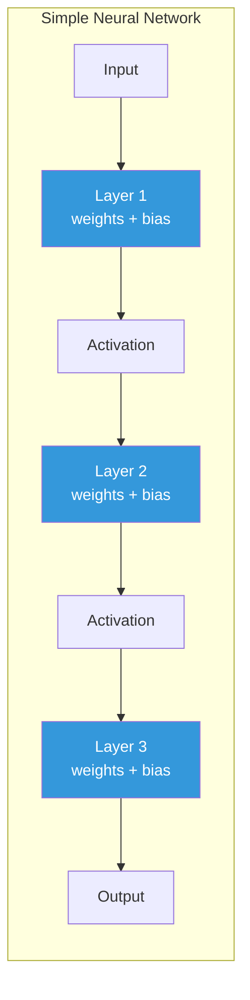
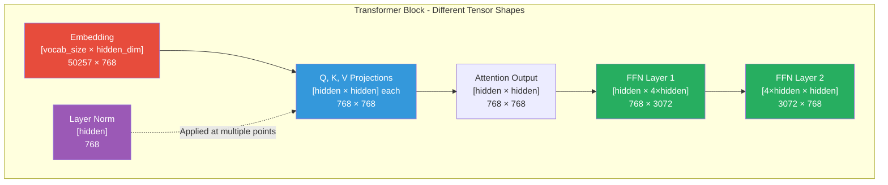
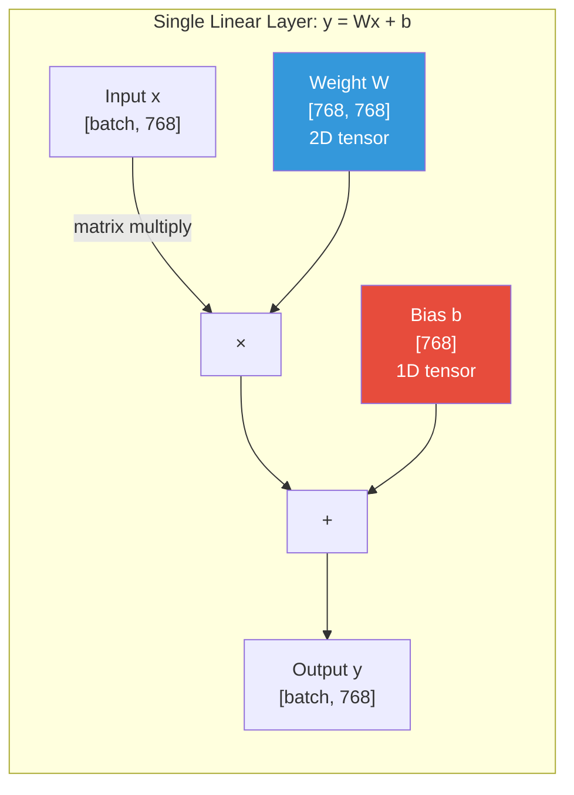
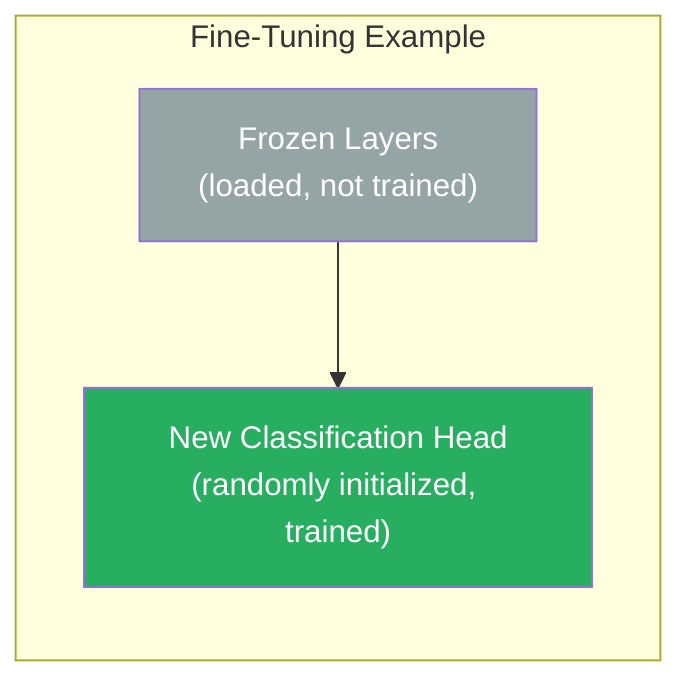
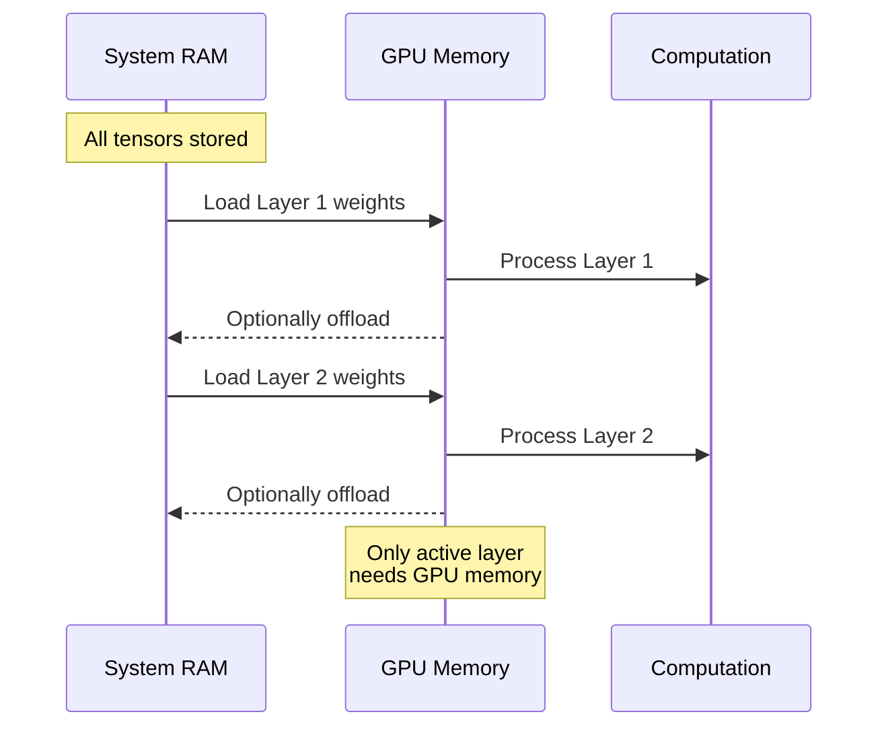
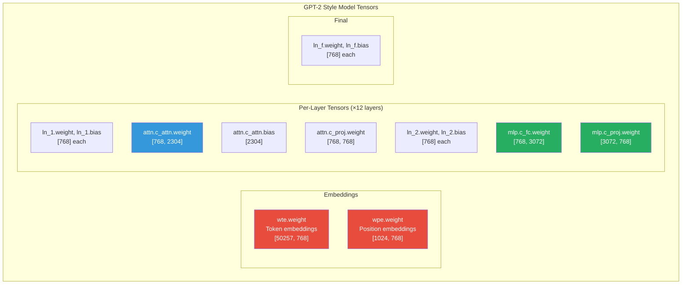
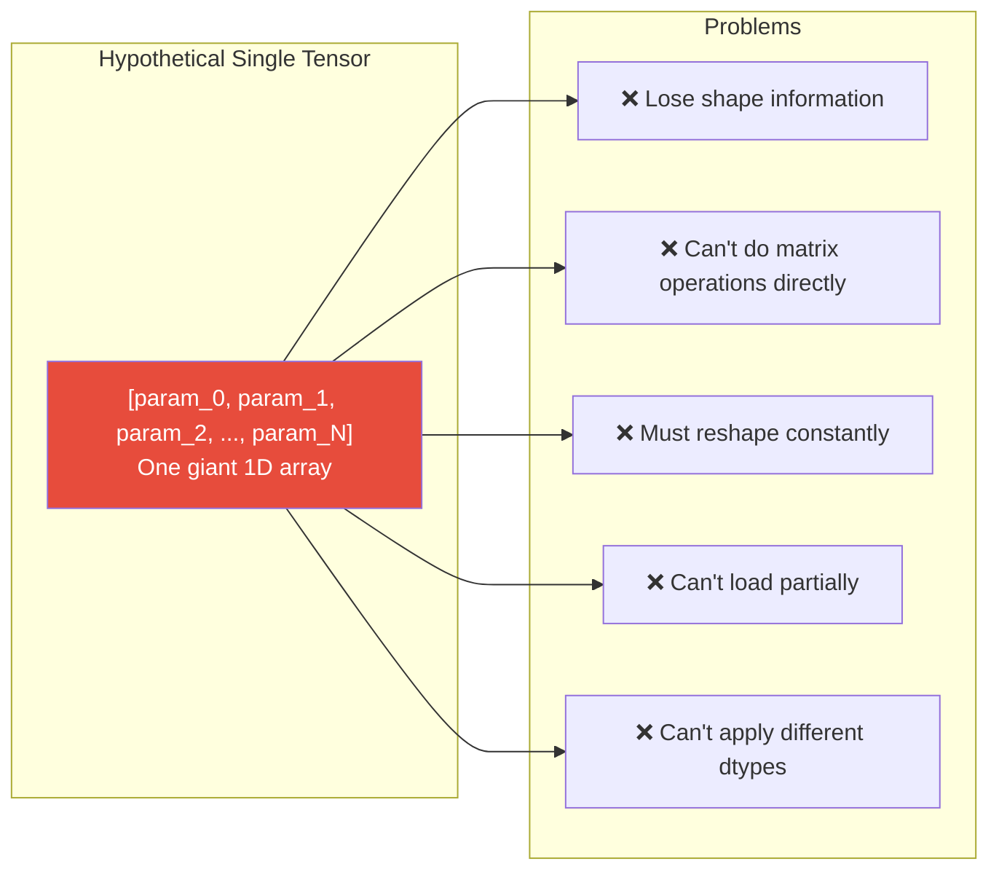
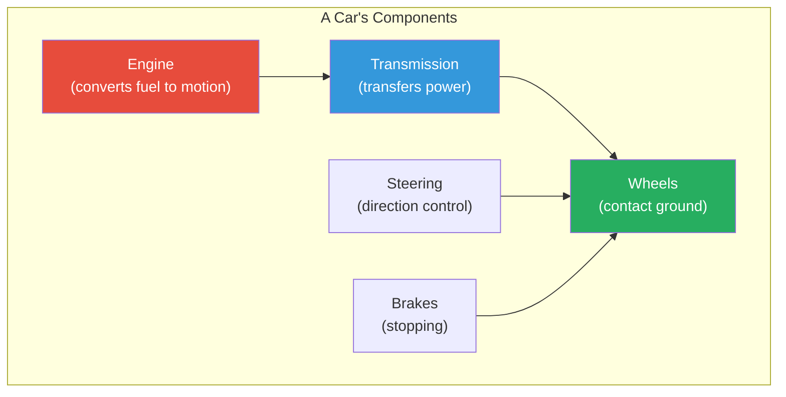

# Why AI Models Consist of Multiple Tensors

This document explains why a `.safetensors` file representing an AI model is composed of many distinct tensors rather than one giant tensor.

---

## The Core Reason: Neural Networks Are Graphs of Operations

A neural network isn't a single mathematical operation—it's a **directed graph** of many distinct operations, each with its own learned parameters.



Each blue box represents **separate tensors** with different shapes and purposes.

---

## Reason 1: Different Shapes for Different Operations

Each layer performs a specific mathematical operation requiring a specific tensor shape.



**You cannot combine a [50257 × 768] tensor with a [768 × 768] tensor into one**—they have incompatible shapes and serve different purposes.

---

## Reason 2: Weights vs. Biases

Even within a single layer, weights and biases are separate tensors:



The weight is a 2D matrix, the bias is a 1D vector. Different shapes = different tensors.

---

## Reason 3: Modularity and Flexibility

Separate tensors enable:

| Capability | How Separate Tensors Help |
|------------|---------------------------|
| **Fine-tuning** | Freeze some layers, train others |
| **Transfer learning** | Replace just the final layer |
| **LoRA adapters** | Add small tensors alongside existing ones |
| **Pruning** | Remove individual layers or heads |
| **Quantization** | Apply different precision to different layers |
| **Inspection** | Analyze specific layer behaviors |



If everything were one tensor, you couldn't selectively freeze or modify parts.

---

## Reason 4: Memory Efficiency During Computation

During inference, not all tensors are needed simultaneously:



Separate tensors allow **layer-by-layer streaming** for models larger than GPU memory.

---

## Reason 5: A Real Model's Tensor Inventory

A typical transformer model contains these tensor categories:



GPT-2 Small has **148 separate tensors**. GPT-2 XL has **292 tensors**. LLaMA 70B has **thousands**.

---

## Why Not Flatten Everything Into One Tensor?

You *could* technically concatenate all parameters into a single 1D tensor:



You'd need a separate metadata structure to track where each layer's parameters begin and end, what shape to reshape them into, etc.—essentially recreating what safetensors already does, but less efficiently.

---

## The Mathematical Perspective

A neural network computes a function by composing many smaller functions:

```
output = f_n( f_{n-1}( ... f_2( f_1( input ) ) ... ) )
```

Each function `f_i` typically has the form:

```
f_i(x) = activation( W_i · x + b_i )
```

Where:
- `W_i` is a weight matrix (2D tensor)
- `b_i` is a bias vector (1D tensor)
- Each layer has its own `W` and `b`

This mathematical structure **inherently requires multiple separate parameter tensors**.

---

## Analogy: A Car vs. Its Parts

Think of asking "why does a car have multiple parts instead of one?"



Each component:
- Has a **different shape** (you can't combine an engine and a wheel)
- Serves a **different function**
- Can be **replaced independently**
- Must be **connected in a specific way**

Neural network tensors are the same—each serves a specific purpose in the computation.

---

## Summary

| Reason | Explanation |
|--------|-------------|
| **Mathematical necessity** | Different operations require different tensor shapes |
| **Architectural structure** | Networks are graphs of distinct operations |
| **Weights vs. biases** | Even one layer has multiple parameter tensors |
| **Modularity** | Enables fine-tuning, pruning, quantization |
| **Memory management** | Allows streaming and partial loading |
| **Framework design** | PyTorch/TensorFlow organize models as named parameter collections |

---

## Conclusion

**The multiple-tensor design directly mirrors the mathematical structure of neural networks.** Each tensor represents a learnable parameter matrix or vector for a specific operation in the computation graph.

A single-tensor design would:
1. Lose the natural correspondence between tensors and operations
2. Require constant reshaping during computation
3. Prevent partial loading and fine-tuning
4. Make the model file format more complex, not simpler

The safetensors format (and all model formats) use multiple named tensors because that's what neural networks fundamentally are: collections of distinct, shaped parameter arrays connected in a computation graph.
