# MermaidJS Complete Diagram Guide

Mermaid is a JavaScript-based diagramming and charting tool that uses text definitions to create diagrams dynamically. This guide covers every diagram type and element available in MermaidJS.

---

## Table of Contents

1. [Flowchart](#1-flowchart)
2. [Sequence Diagram](#2-sequence-diagram)
3. [Class Diagram](#3-class-diagram)
4. [State Diagram](#4-state-diagram)
5. [Entity Relationship Diagram](#5-entity-relationship-diagram)
6. [User Journey](#6-user-journey)
7. [Gantt Chart](#7-gantt-chart)
8. [Pie Chart](#8-pie-chart)
9. [Quadrant Chart](#9-quadrant-chart)
10. [Requirement Diagram](#10-requirement-diagram)
11. [Gitgraph Diagram](#11-gitgraph-diagram)
12. [Mindmap](#12-mindmap)
13. [Timeline](#13-timeline)
14. [Sankey Diagram](#14-sankey-diagram)
15. [XY Chart](#15-xy-chart)
16. [Block Diagram](#16-block-diagram)
17. [Packet Diagram](#17-packet-diagram)
18. [Architecture Diagram](#18-architecture-diagram)
19. [Kanban Board](#19-kanban-board)

---

## 1. Flowchart

Flowcharts are composed of nodes and edges. They support various shapes, link styles, and directions.

### Directions

- `TB` / `TD` - Top to Bottom
- `BT` - Bottom to Top
- `LR` - Left to Right
- `RL` - Right to Left

### Node Shapes

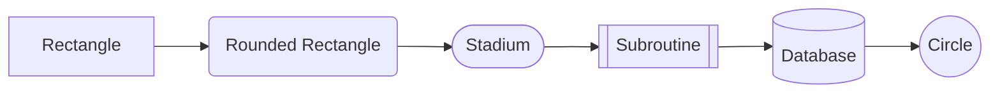

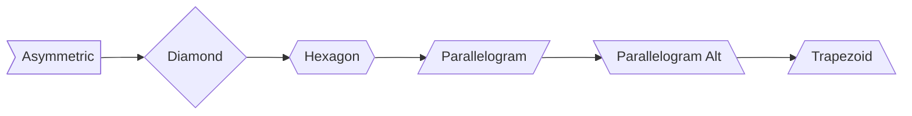

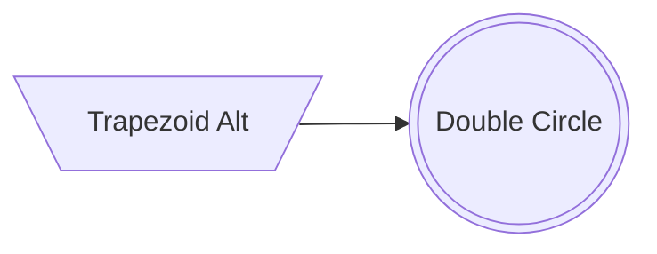

### Link/Edge Types

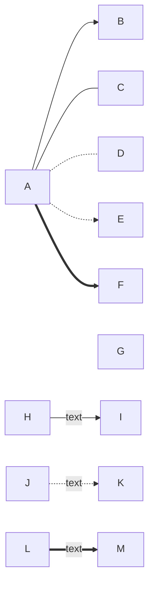

### Link Length

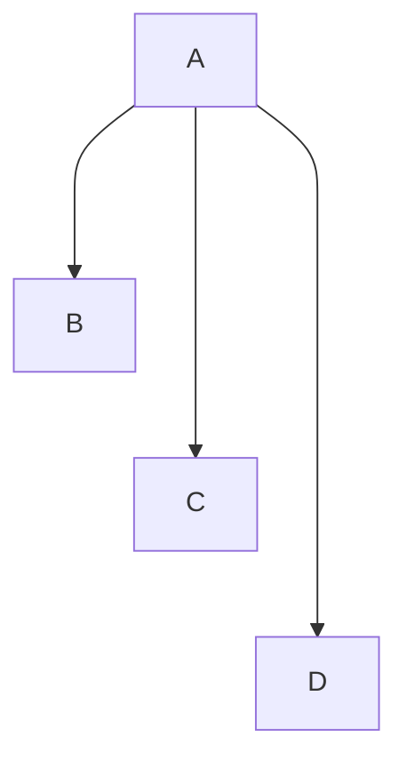

### Subgraphs

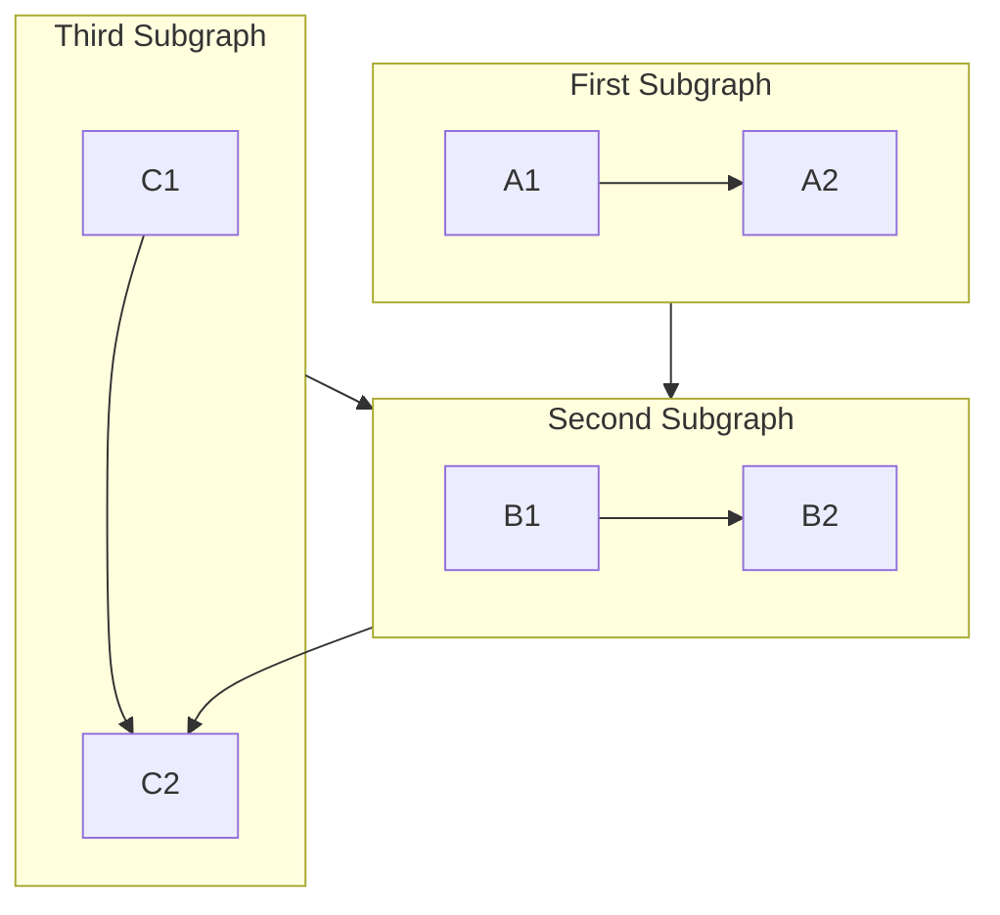

### Styling

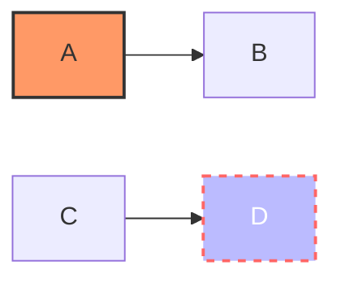

### Complete Flowchart Example

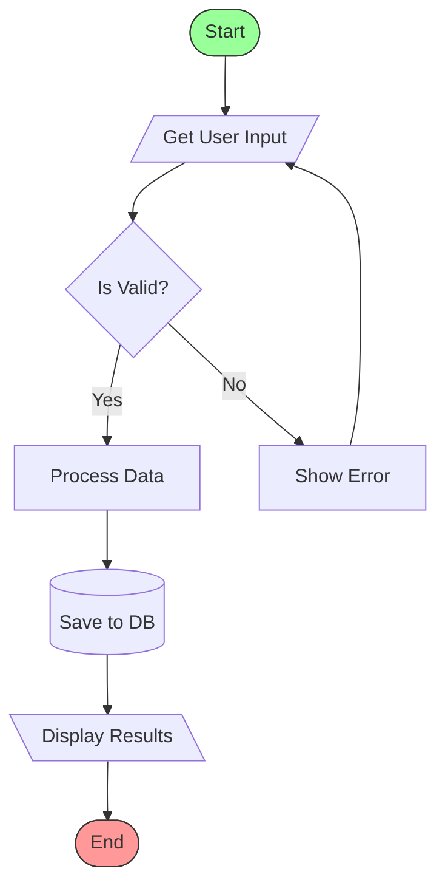

---

## 2. Sequence Diagram

Sequence diagrams show how processes interact with each other and in what order.

### Participants and Actors

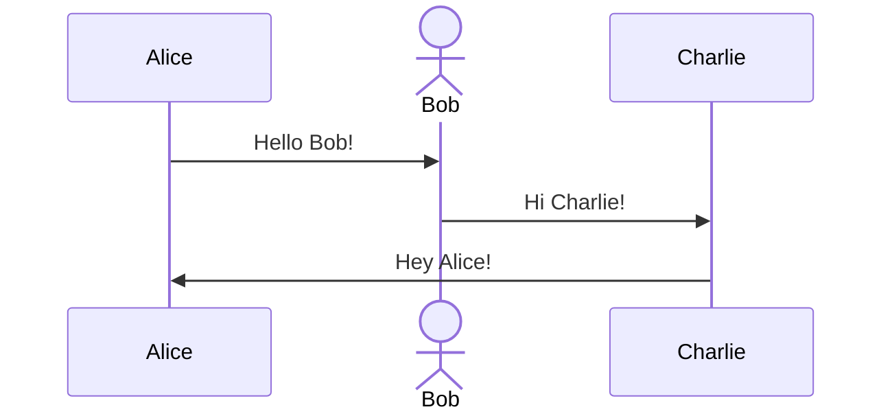

### Message Types

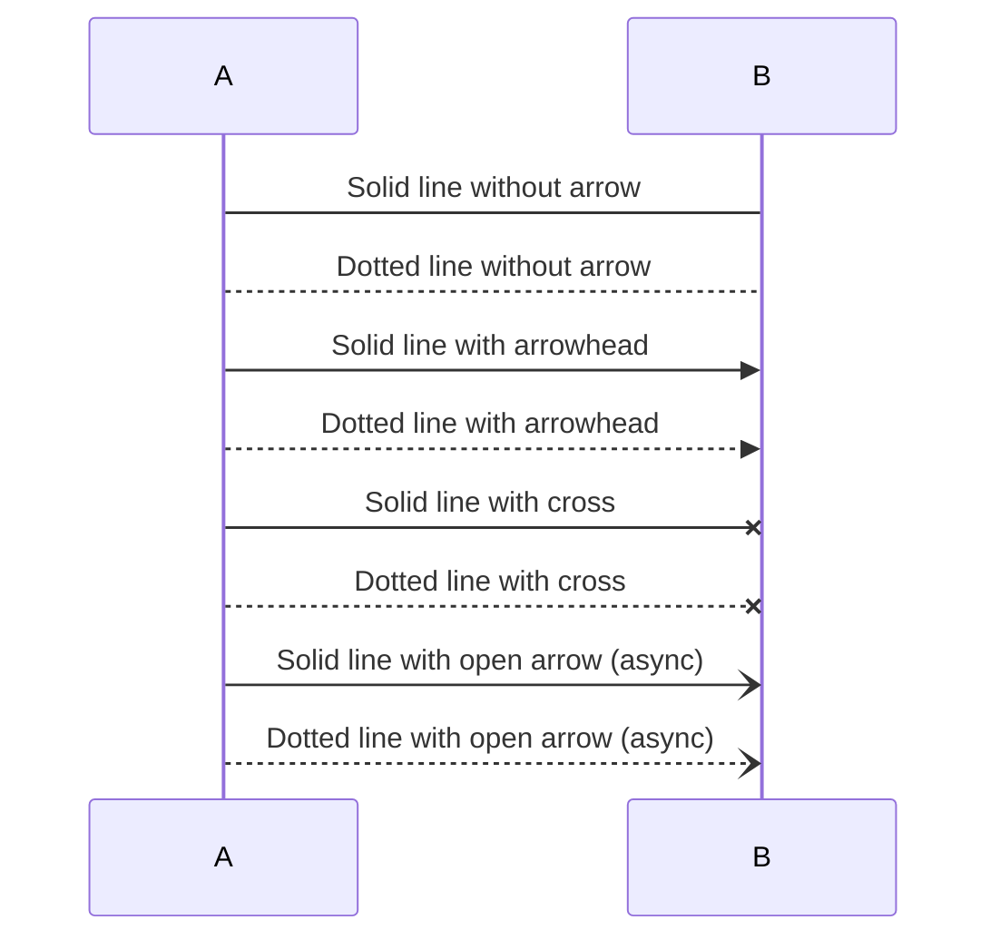

### Activations

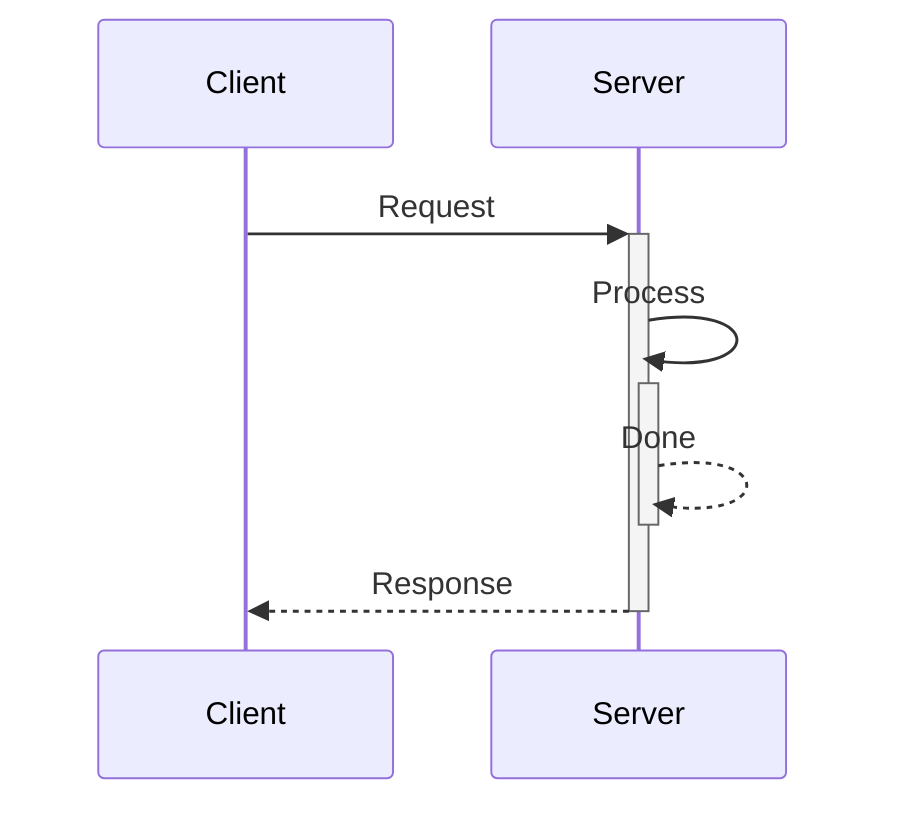

### Notes

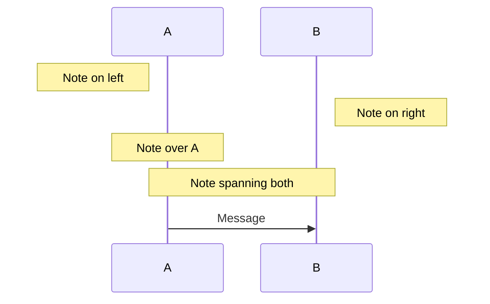

### Loops, Alt, Opt, Par, Critical, Break

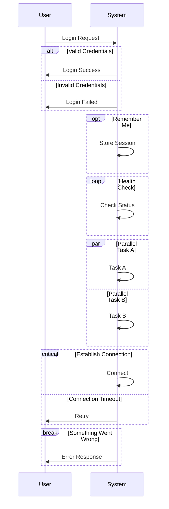

### Boxes (Grouping)

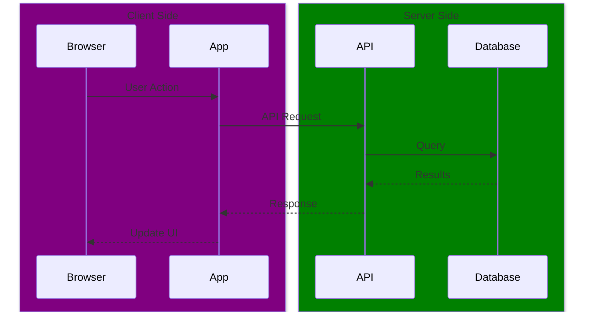

### Autonumbering

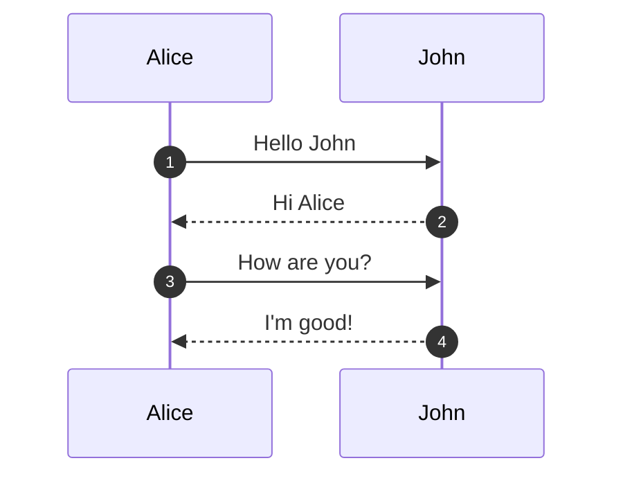

---

## 3. Class Diagram

Class diagrams are used in object-oriented modeling to describe the structure of a system.

### Basic Class Definition

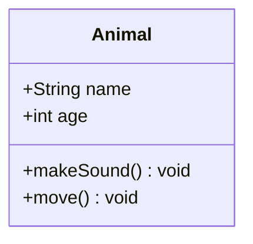

### Visibility Modifiers

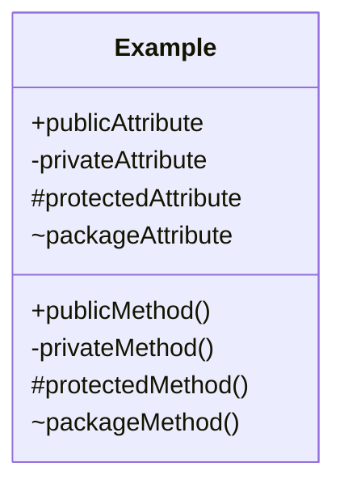

### Relationships

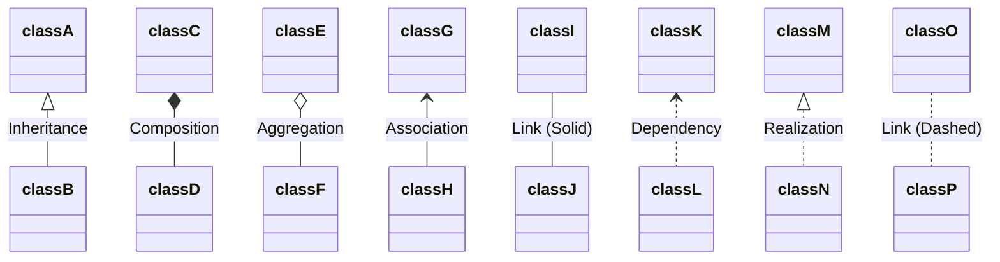

### Cardinality

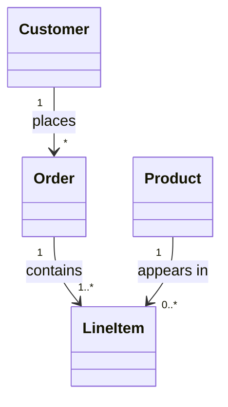

### Class Annotations

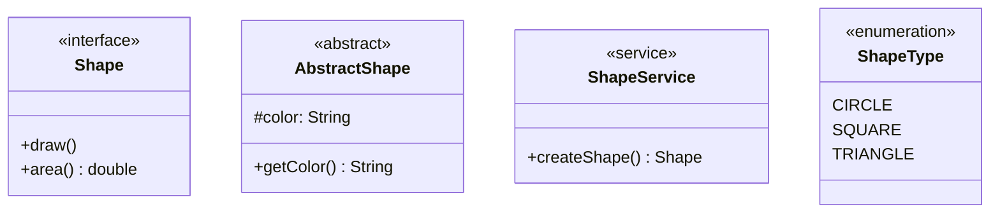

### Complete Example

```mermaid
classDiagram
    class Animal {
        <<abstract>>
        +String name
        +int age
        +makeSound()* void
        +move() void
    }
    
    class Dog {
        +String breed
        +makeSound() void
        +fetch() void
    }
    
    class Cat {
        +boolean indoor
        +makeSound() void
        +scratch() void
    }
    
    class Pet {
        <<interface>>
        +play() void
        +feed() void
    }
    
    Animal <|-- Dog
    Animal <|-- Cat
    Pet <|.. Dog
    Pet <|.. Cat
```

### Namespaces

```mermaid
classDiagram
    namespace Animals {
        class Dog
        class Cat
    }
    namespace Vehicles {
        class Car
        class Bike
    }
```

---

## 4. State Diagram

State diagrams describe the behavior of a system, showing states and transitions.

### Basic States

```mermaid
stateDiagram-v2
    [*] --> Idle
    Idle --> Processing : Start
    Processing --> Completed : Finish
    Completed --> [*]
```

### Composite States

```mermaid
stateDiagram-v2
    [*] --> Active
    
    state Active {
        [*] --> Idle
        Idle --> Running : start
        Running --> Idle : stop
        Running --> Running : process
    }
    
    Active --> Inactive : deactivate
    Inactive --> Active : activate
    Inactive --> [*]
```

### Fork and Join

```mermaid
stateDiagram-v2
    state fork_state <<fork>>
    state join_state <<join>>
    
    [*] --> fork_state
    fork_state --> State1
    fork_state --> State2
    fork_state --> State3
    
    State1 --> join_state
    State2 --> join_state
    State3 --> join_state
    
    join_state --> FinalState
    FinalState --> [*]
```

### Choice

```mermaid
stateDiagram-v2
    state check_result <<choice>>
    
    [*] --> Processing
    Processing --> check_result
    check_result --> Success : if valid
    check_result --> Failure : if invalid
    Success --> [*]
    Failure --> [*]
```

### Notes

```mermaid
stateDiagram-v2
    [*] --> Active
    Active --> Inactive
    
    note right of Active
        This is an active state
        It can process events
    end note
    
    note left of Inactive : This is inactive
```

### Concurrency

```mermaid
stateDiagram-v2
    [*] --> Active
    
    state Active {
        [*] --> ProcessA
        --
        [*] --> ProcessB
        --
        [*] --> ProcessC
    }
    
    Active --> [*]
```

### Direction

```mermaid
stateDiagram-v2
    direction LR
    [*] --> A
    A --> B
    B --> C
    C --> [*]
```

---

## 5. Entity Relationship Diagram

ER diagrams show relationships between entities in a database.

### Relationship Types

```mermaid
erDiagram
    CUSTOMER ||--o{ ORDER : places
    ORDER ||--|{ LINE-ITEM : contains
    CUSTOMER }|..|{ DELIVERY-ADDRESS : uses
    PRODUCT ||--o{ LINE-ITEM : "ordered in"
```

### Cardinality Notation

| Value | Meaning |
|-------|---------|
| `\|o` | Zero or one |
| `\|\|` | Exactly one |
| `}o` | Zero or more |
| `}\|` | One or more |

### Entity Attributes

```mermaid
erDiagram
    CUSTOMER {
        int id PK
        string name
        string email UK
        date created_at
    }
    
    ORDER {
        int id PK
        int customer_id FK
        date order_date
        decimal total
    }
    
    PRODUCT {
        int id PK
        string name
        decimal price
        string description
    }
    
    LINE_ITEM {
        int id PK
        int order_id FK
        int product_id FK
        int quantity
    }
    
    CUSTOMER ||--o{ ORDER : places
    ORDER ||--|{ LINE_ITEM : contains
    PRODUCT ||--o{ LINE_ITEM : included_in
```

### Attribute Types

```mermaid
erDiagram
    ENTITY {
        type attribute_name PK "Primary Key"
        type attribute_name FK "Foreign Key"
        type attribute_name UK "Unique Key"
    }
```

---

## 6. User Journey

User journey diagrams describe the steps a user takes to complete a task.

```mermaid
journey
    title My Working Day
    section Morning
        Wake up: 1: Me
        Breakfast: 3: Me
        Commute: 2: Me, Bus
    section Work
        Check emails: 3: Me
        Meeting: 2: Me, Colleagues
        Lunch: 5: Me
        Coding: 4: Me
    section Evening
        Commute home: 2: Me, Bus
        Dinner: 5: Me, Family
        Sleep: 5: Me
```

### Score Values

Scores range from 1 to 5:
- 1: Very negative experience
- 2: Negative experience
- 3: Neutral experience
- 4: Positive experience
- 5: Very positive experience

---

## 7. Gantt Chart

Gantt charts illustrate project schedules.

### Basic Gantt

```mermaid
gantt
    title Project Timeline
    dateFormat YYYY-MM-DD
    
    section Planning
        Requirements    :a1, 2024-01-01, 7d
        Design          :a2, after a1, 5d
    
    section Development
        Backend         :b1, after a2, 14d
        Frontend        :b2, after a2, 14d
        Integration     :b3, after b1, 5d
    
    section Testing
        Unit Tests      :c1, after b3, 7d
        QA Testing      :c2, after c1, 7d
```

### Task Types

```mermaid
gantt
    title Task Types Example
    dateFormat YYYY-MM-DD
    
    section Tasks
        Normal task         :a1, 2024-01-01, 3d
        Critical task       :crit, a2, after a1, 2d
        Done task           :done, a3, after a2, 2d
        Active task         :active, a4, after a3, 3d
        Milestone           :milestone, m1, after a4, 0d
```

### Sections and Dependencies

```mermaid
gantt
    title Software Development Lifecycle
    dateFormat YYYY-MM-DD
    excludes weekends
    
    section Analysis
        Gather Requirements     :done, req, 2024-01-01, 5d
        Analyze Requirements    :done, ana, after req, 3d
    
    section Design
        System Design           :active, des, after ana, 5d
        UI/UX Design            :uix, after ana, 7d
    
    section Implementation
        Core Development        :dev, after des, 15d
        API Development         :api, after des, 10d
    
    section Testing
        Testing                 :test, after dev, 10d
        
    section Deployment
        Deployment              :milestone, dep, after test, 0d
```

---

## 8. Pie Chart

```mermaid
pie showData
    title Browser Market Share
    "Chrome" : 65
    "Safari" : 19
    "Firefox" : 4
    "Edge" : 4
    "Other" : 8
```

```mermaid
pie
    title Project Budget Allocation
    "Development" : 45
    "Marketing" : 20
    "Operations" : 15
    "Support" : 12
    "R&D" : 8
```

---

## 9. Quadrant Chart

Quadrant charts plot items on a 2x2 grid for prioritization or classification.

```mermaid
quadrantChart
    title Product Feature Prioritization
    x-axis Low Effort --> High Effort
    y-axis Low Impact --> High Impact
    quadrant-1 Plan
    quadrant-2 Do First
    quadrant-3 Delegate
    quadrant-4 Eliminate

    Feature A: [0.8, 0.9]
    Feature B: [0.3, 0.8]
    Feature C: [0.7, 0.3]
    Feature D: [0.2, 0.2]
    Feature E: [0.5, 0.5]
    Feature F: [0.9, 0.7]
```

```mermaid
quadrantChart
    title Skill Assessment
    x-axis Low Competence --> High Competence
    y-axis Low Interest --> High Interest
    quadrant-1 Develop
    quadrant-2 Leverage
    quadrant-3 Ignore
    quadrant-4 Delegate

    Python: [0.9, 0.8]
    JavaScript: [0.7, 0.7]
    Rust: [0.3, 0.9]
    Java: [0.6, 0.3]
    Go: [0.4, 0.6]
```

---

## 10. Requirement Diagram

Requirement diagrams show requirements and their relationships.

```mermaid
requirementDiagram
    requirement user_auth {
        id: REQ-001
        text: The system shall authenticate users
        risk: high
        verifymethod: test
    }
    
    requirement password_policy {
        id: REQ-002
        text: Passwords must be at least 8 characters
        risk: medium
        verifymethod: inspection
    }
    
    requirement session_mgmt {
        id: REQ-003
        text: Sessions shall expire after 30 minutes
        risk: low
        verifymethod: demonstration
    }
    
    element auth_module {
        type: module
        docRef: auth_design_doc
    }
    
    element login_test {
        type: testCase
        docRef: test_plan_001
    }
    
    user_auth - derives -> password_policy
    user_auth - derives -> session_mgmt
    auth_module - satisfies -> user_auth
    login_test - verifies -> user_auth
```

### Relationship Types

- `contains` - Requirement contains another requirement
- `copies` - Requirement is a copy of another
- `derives` - Requirement derives from another
- `satisfies` - Element satisfies requirement
- `verifies` - Element verifies requirement
- `refines` - Requirement refines another
- `traces` - Requirement traces to another

---

## 11. Gitgraph Diagram

Gitgraph diagrams visualize git branching and merging.

```mermaid
gitGraph
    commit id: "Initial"
    commit id: "Add README"
    branch develop
    checkout develop
    commit id: "Setup project"
    commit id: "Add core features"
    branch feature/auth
    checkout feature/auth
    commit id: "Add login"
    commit id: "Add logout"
    checkout develop
    merge feature/auth
    branch feature/dashboard
    checkout feature/dashboard
    commit id: "Create dashboard"
    commit id: "Add widgets"
    checkout develop
    merge feature/dashboard
    checkout main
    merge develop tag: "v1.0.0"
    commit id: "Hotfix"
```

### Customization Options

```mermaid
%%{init: { 'gitGraph': {'showBranches': true, 'showCommitLabel':true,'mainBranchName': 'production'}} }%%
gitGraph
    commit id: "1"
    commit id: "2"
    branch staging
    checkout staging
    commit id: "3"
    checkout production
    merge staging
    commit id: "4"
```

### Cherry-pick

```mermaid
gitGraph
    commit id: "A"
    commit id: "B"
    branch develop
    commit id: "C"
    commit id: "D"
    checkout main
    cherry-pick id: "C"
    commit id: "E"
```

---

## 12. Mindmap

Mindmaps visualize hierarchical information.

```mermaid
mindmap
    root((Project Planning))
        Research
            Market Analysis
            Competitor Review
            User Surveys
        Design
            Wireframes
            Mockups
            Prototypes
        Development
            Frontend
                React
                CSS
                TypeScript
            Backend
                Node.js
                Database
                API
        Testing
            Unit Tests
            Integration Tests
            E2E Tests
        Deployment
            CI/CD
            Monitoring
            Scaling
```

### Node Shapes

```mermaid
mindmap
    root)Cloud Shape(
        (Rounded Square)
            [Square]
                {{Hexagon}}
        ))Bang((
            Default Text
```

### Icons and Classes

```mermaid
mindmap
    root((Central Topic))
        ::icon(fa fa-book)
        Topic A
            Subtopic A1
            Subtopic A2
        Topic B
            ::icon(fa fa-code)
            Subtopic B1
        Topic C
```

---

## 13. Timeline

Timeline diagrams show events over time.

```mermaid
timeline
    title History of Web Development
    
    section 1990s
        1991 : First website created
        1993 : HTML 1.0
        1995 : JavaScript created
             : PHP released
        1996 : CSS 1.0
        1998 : Google founded
    
    section 2000s
        2004 : Facebook launched
        2005 : YouTube launched
             : AJAX popularized
        2006 : jQuery released
        2008 : HTML5 draft
    
    section 2010s
        2010 : AngularJS
        2013 : React released
        2014 : Vue.js released
        2015 : ES6/ES2015
    
    section 2020s
        2020 : Remote work boom
        2022 : ChatGPT launched
        2023 : AI integration
```

---

## 14. Sankey Diagram

Sankey diagrams visualize flow quantities between nodes.

```mermaid
sankey-beta

%% source, target, value
Electricity,Residential,30
Electricity,Commercial,25
Electricity,Industrial,45

Natural Gas,Residential,20
Natural Gas,Commercial,15
Natural Gas,Industrial,35

Coal,Industrial,50
Coal,Power Plants,100

Power Plants,Electricity,100

Renewable,Electricity,40
```

```mermaid
sankey-beta

Budget,Marketing,250
Budget,Development,400
Budget,Operations,200
Budget,HR,150

Marketing,Digital,150
Marketing,Traditional,100

Development,Frontend,150
Development,Backend,150
Development,DevOps,100

Operations,Infrastructure,100
Operations,Support,100
```

---

## 15. XY Chart

XY charts display data on a coordinate system.

### Bar Chart

```mermaid
xychart-beta
    title "Monthly Sales"
    x-axis [Jan, Feb, Mar, Apr, May, Jun, Jul, Aug, Sep, Oct, Nov, Dec]
    y-axis "Revenue (in $1000)" 0 --> 150
    bar [50, 60, 75, 90, 80, 95, 110, 120, 100, 85, 95, 130]
```

### Line Chart

```mermaid
xychart-beta
    title "Temperature Trend"
    x-axis [Mon, Tue, Wed, Thu, Fri, Sat, Sun]
    y-axis "Temperature (°C)" 0 --> 40
    line [22, 24, 26, 28, 25, 23, 21]
```

### Combined Bar and Line

```mermaid
xychart-beta
    title "Sales vs Target"
    x-axis [Q1, Q2, Q3, Q4]
    y-axis "Amount ($)" 0 --> 200
    bar [120, 150, 140, 180]
    line [100, 130, 160, 190]
```

---

## 16. Block Diagram

Block diagrams show system components and their relationships.

```mermaid
block-beta
    columns 3
    
    Frontend:3
    
    space API space
    
    block:backend:3
        columns 3
        Auth Database Cache
    end
    
    space Storage space
```

```mermaid
block-beta
    columns 5
    
    User space:3 Admin
    
    space down1<["  "]>(down) space down2<["  "]>(down) space
    
    space WebApp:3 space
    
    space down3<["  "]>(down) space
    
    space API:3 space
    
    space down4<["  "]>(down) space
    
    DB[("Database")]:5
```

### Block Shapes

```mermaid
block-beta
    A["Rectangle"]
    B("Rounded")
    C(("Circle"))
    D{{"Hexagon"}}
    E[/"Parallelogram"/]
    F[\\"Parallelogram Alt"\\]
    G[("Cylinder")]
    H>"Asymmetric"]
```

---

## 17. Packet Diagram

Packet diagrams show the structure of network packets.

```mermaid
packet-beta
    0-15: "Source Port"
    16-31: "Destination Port"
    32-63: "Sequence Number"
    64-95: "Acknowledgment Number"
    96-99: "Data Offset"
    100-102: "Reserved"
    103: "NS"
    104: "CWR"
    105: "ECE"
    106: "URG"
    107: "ACK"
    108: "PSH"
    109: "RST"
    110: "SYN"
    111: "FIN"
    112-127: "Window Size"
    128-143: "Checksum"
    144-159: "Urgent Pointer"
    160-191: "Options (if Data Offset > 5)"
```

---

## 18. Architecture Diagram

Architecture diagrams show system architecture with cloud/infrastructure components.

```mermaid
architecture-beta
    group cloud(cloud)[Cloud Platform]
    
    service users(internet)[Users] in cloud
    service lb(server)[Load Balancer] in cloud
    service api(server)[API Server] in cloud
    service db(database)[Database] in cloud
    
    users:R --> L:lb
    lb:R --> L:api
    api:R --> L:db
```

---

## 19. Kanban Board

Kanban diagrams visualize work items across workflow stages.

```mermaid
kanban
    column1[Todo]
        task1[Design homepage]
        task2[Write documentation]
        task3[Create database schema]
    
    column2[In Progress]
        task4[Implement auth]
        task5[Build API endpoints]
    
    column3[Review]
        task6[Code review: login]
    
    column4[Done]
        task7[Setup project]
        task8[Configure CI/CD]
```

---

## Theming and Configuration

### Built-in Themes

Mermaid supports several built-in themes:
- `default`
- `neutral`
- `dark`
- `forest`
- `base`

```mermaid
%%{init: {'theme': 'forest'}}%%
flowchart LR
    A --> B --> C --> D
```

### Custom Theme Variables

```mermaid
%%{init: {
    'theme': 'base',
    'themeVariables': {
        'primaryColor': '#ff6b6b',
        'primaryTextColor': '#fff',
        'primaryBorderColor': '#c92a2a',
        'lineColor': '#868e96',
        'secondaryColor': '#ffd43b',
        'tertiaryColor': '#e9ecef'
    }
}}%%
flowchart LR
    A[Start] --> B{Decision}
    B -->|Yes| C[Action 1]
    B -->|No| D[Action 2]
    C --> E[End]
    D --> E
```

---

## Directives and Comments

### Comments

```mermaid
flowchart LR
    %% This is a comment
    A --> B
    %% Another comment
    B --> C
```

### Directives

```mermaid
%%{init: {"flowchart": {"htmlLabels": false}} }%%
flowchart LR
    A --> B
```

---

## Accessibility

Mermaid supports accessibility descriptions:

```mermaid
flowchart LR
    accTitle: Simple Flow
    accDescr: A flow showing three connected nodes A, B, and C
    
    A --> B --> C
```

---

## Tips and Best Practices

1. **Keep diagrams simple**: Complex diagrams become hard to read
2. **Use meaningful labels**: Clear labels improve understanding
3. **Choose the right diagram type**: Match the diagram to your data
4. **Use subgraphs for organization**: Group related elements
5. **Apply consistent styling**: Use themes or custom styles consistently
6. **Add titles and descriptions**: Improve accessibility and context
7. **Test rendering**: Different renderers may have slight variations

---

## Resources

- [Mermaid Official Documentation](https://mermaid.js.org/)
- [Mermaid Live Editor](https://mermaid.live/)
- [GitHub Repository](https://github.com/mermaid-js/mermaid)

---

*This guide covers MermaidJS version 10.x. Some features may vary in different versions.*
