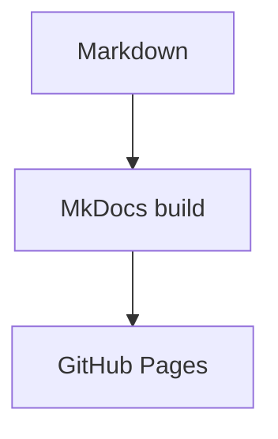

# Home

Welcome to my site.

You will find various articles here on technical subjects which interest me. Most of these articles were written by AI agents in the course of conversations had with me. The conversations are grouped together as project folders in the left sidebar. 

I use [Obsidian](https://obsidian.md) to organise and view that material locally and [git](https://git-scm.com) to manage version control and distribution. 

Content is created by AI in [Markdown](https://www.markdownguide.org), converted into html by [Material for MKDocs](https://squidfunk.github.io/mkdocs-material/) and published to [GitHub Pages](https://docs.github.com/en/pages). 

Diagrams are generated using [Mermaid](https://mermaid.js.org) embedded markdown. 

